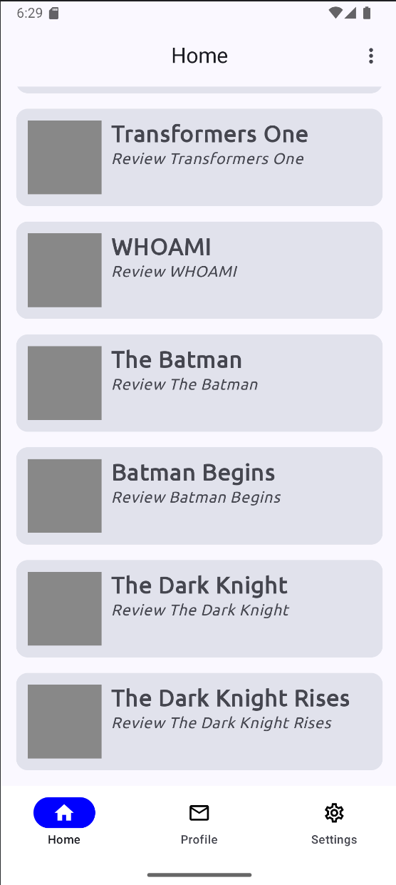

#StudyGroupMobileProgrammingMotionLab

Week 1- Introduction to Android Development

Untuk Week 1 ini, aplikasi yang telah saya buat memiliki fitur login dengan memasukkan username dan password dan jika login berhasil, maka akan berpindah ke homepage. Di dalam homepage juga bisa dilakukan logout yang akan mengembalikan user ke page login

 
 
jika tombol login dipencet tetapi username dan/atau password kosong, maka akan muncul text peringatan seperti dibawah ini

jika tombol login dipencet dan username dan password sudah terisi, maka user akan berpindah ke homepage dan akan muncul text seperti dibawah ini

dan ini tampilan dari homepage yang telah saya buat

jika tombol logout dipencet dan username dan password sudah terisi, maka user akan berpindah ke login page dan akan muncul text seperti dibawah ini

Dan juga terdapat log untuk mencatat tiap terjadinya login atau logout seperti dibawah ini

